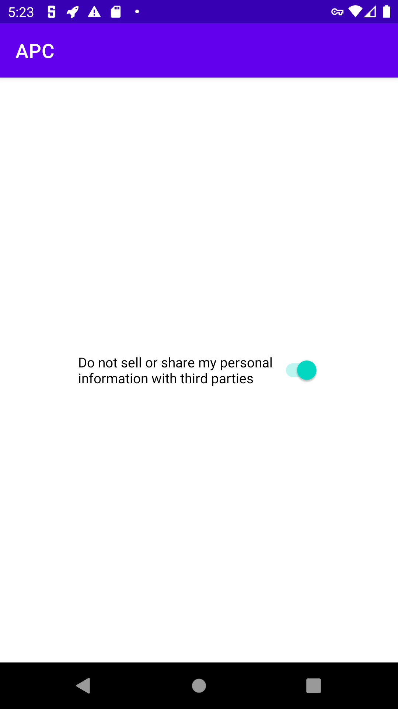

# Global Privacy Control (GPC) for Android: Proof of Concept

THIS CODE IS NOT FOR PRODUCTION USE

This repository contains a **PROOF OF CONCEPT** implementation of the [Global Privacy Control (GPC)](https://globalprivacycontrol.org) for Android.

To accomplish this, this repo contains the code for two apps: 1) a consent app, in which users can pick their consent preferences, and 2) a test app, which retrieves a user’s consent choice.

The code was tested on a Pixel 4 running the latest Android 13, with each app signed with different certificates in a release build.

The following shows one screenshot for each of the two apps:

    
    

Note that the word 'consent' assumes use under the EU GDPR, while applications in California would need a different wording. The purpose of this proof of concept is solely to demonstrate technical feasibility rather than UI design.
